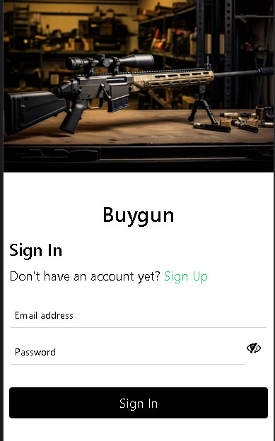
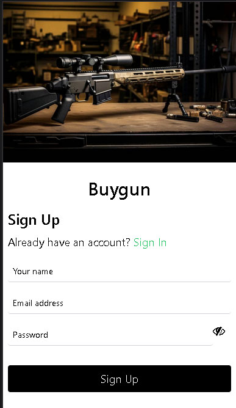
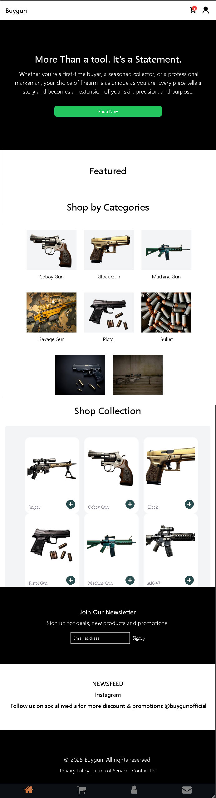
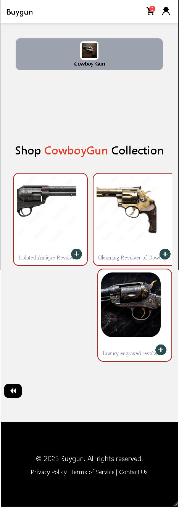
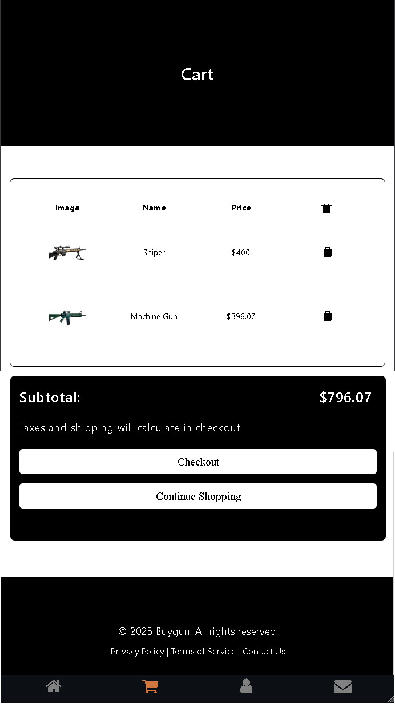
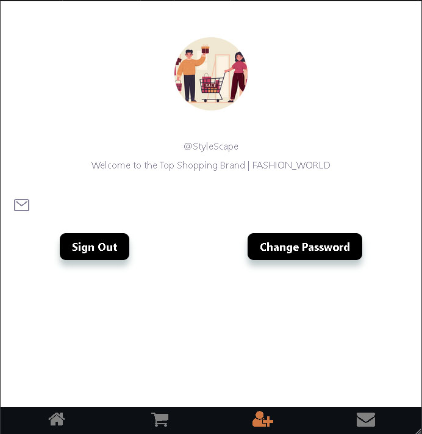
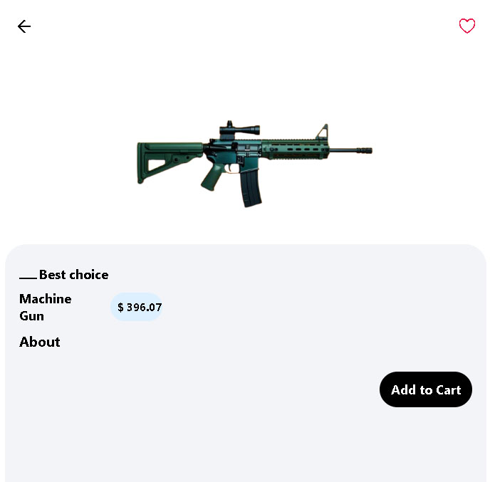

<h1 align ="center" > 🖥️ 📸 📱 🤖 - React Native Guns Ecommerce 06  </h1>
<h3  align ="center"> 
A boilerplate for a Ecommerce mobile app using React Native and Context, Firebase Auth. IOs and Android, Backend Data From JSON file </h3>
<br>

  * [Configuration and Setup](#configuration-and-setup)
  * [Key Features](#key-features)
  * [Technologies used](#technologies-used)
      - [Frontend](#frontend)
  * [📸 Screenshots](#screenshots)
  * [Author](#author)
  * <br>
  * ## Configuration and Setup

In order to run this project locally, simply fork and clone the repository or download as zip and unzip on your machine.

- Open the project in your prefered code editor.
- Go to terminal -> New terminal (If you are using VS code)

```
$ cd client 
$ npm install (to install client-side dependencies)
$ npx expo start -c  (to start the application - cleaning Cache Memory)

```


## ✔️ Tecnologias Utilizadas:


##  Screenshots:
<br>









<br>

##  Key Features:

Cart (List)
Add To Cart
Remove Cart
Category
Best Selling
Filters
Product Review (Listing)  
<br/>

##  Technologies used

This project was created using the following technologies.

####  Frontend 

- [React Native ]() - It is a framework developed by Facebook for creating native-style apps for iOS & Android under one common language, JavaScript.
- [React Hooks  ](https://reactjs.org/docs/hooks-intro.html) - For managing and centralizing application state
- [react-navigation/native](https://reactnavigation.org/)) - To handle routing
- [RN - styled Components](https://styled-components.com/docs/basics) - Utilises tagged template literals to style your components
- [ReactContext](https://react-context.js.org/) - manage application state efficiently and provide a more structured mechanism for managing data

## Author
- Portfolio: 
- Github: 
- Sponsor: 
- Linkedin:([https://www.linkedin.com/in/sergio-moncada-rivas-4ab877351/)])
- Email: [sergiogmoncada
